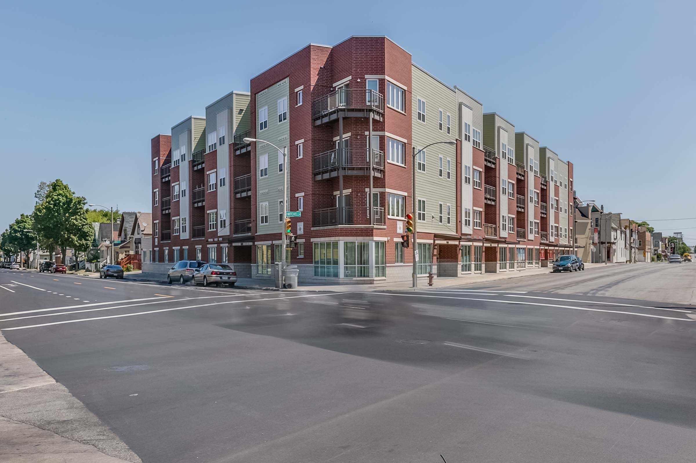

### [Mitchell Street Market Lofts Preliminary Design](http://www.impactseven.org/portfolio-items/mitchell-street-market-lofts/)
#### New Construction Affordable Housing Development

Located in the Muskego Way neighborhood in Milwaukee, WI and built on
what was once a city-owned vacant brownfield lot, Mitchell Street Market
Lofts is a new construction affordable housing development. I created
the original design of these lofts during Senior Design. We pitched the
design to the eventual developers. After a few small tweaks, we passed
off the preliminary design to the Architects and it lead to what you can
see now.
