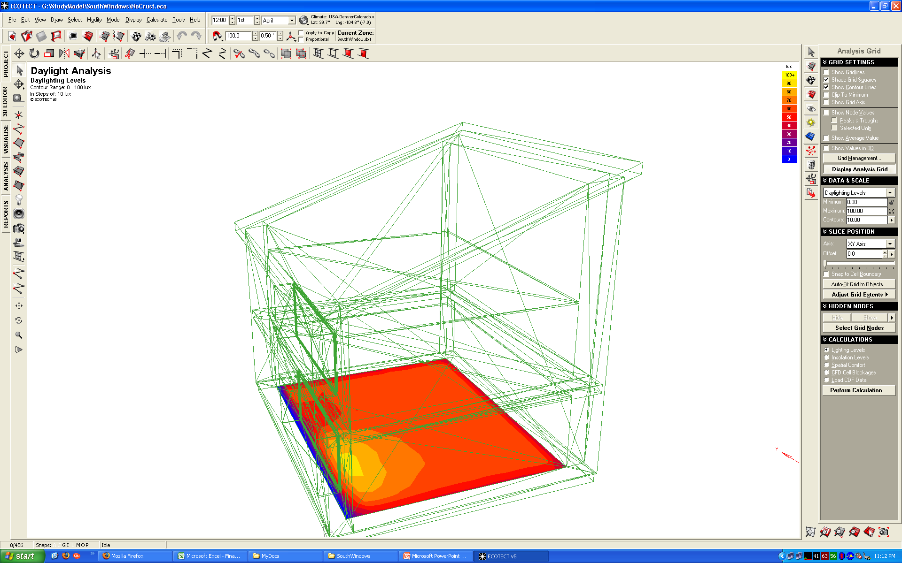

### [Rapid Prototyping: A Sustainable Design Aid](https://www.nsf.gov/awardsearch/showAward?AWD_ID=0648845)

#### 3D Printing Research Back in 2009

I researched the applicability of creating a Revit model, running
daylighting analyses and exporting the colored model to be 3D printed in
color.

The purpose of the research was to explore the feasibility of performing
energy analyses early in the design stage of building. This has become
much more commonplace since my research. Utilizing computer programs
simplifies and expedites the energy modeling process. Energy modeling
was examined to determine the ease of use and feasibility of using such
a device to help designers understand the priorities behind passive
design. A visual, as well as a textual, analysis can be performed and
used to help educate not only designers but the client. Using rapid
prototyping, a striking visual model can be created to help convey the
energy efficiencies as well as the architectural highlights of the
building.
